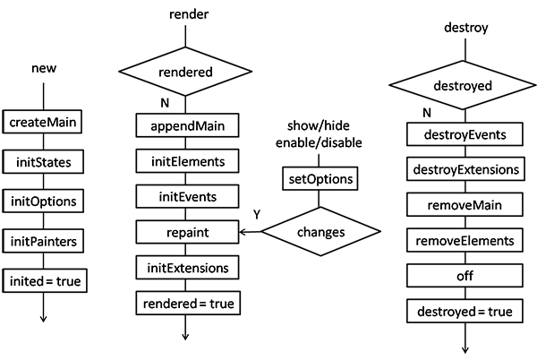
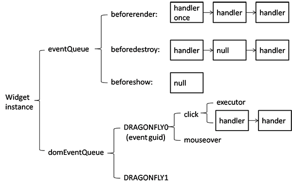

#开发规范（内部版）

##代码风格
控件库的各模块应该保持代码风格的一致性，请参见内部的[《前端编码规范》](http://biztech.sogou-inc.com/wiki/index.php/%E5%89%8D%E7%AB%AF%E7%BC%96%E7%A0%81%E8%A7%84%E8%8C%83)，着重说明几点：

1. 左括号的左边需要有空白（函数声明和调用除外），右括号的右边需要有空白
2. 为保证在各种编辑器下的显示效果，缩进一律使用 `4个空格`
3. if、while、for、do语句，总用{ }将执行体包围
4. 常量命名全大写，变量与函数使用 `camel` 命名，类名使用 `pascal` 命名
5. 字符串用单引号
5. css前缀 `df-`

##文件命名与目录规范

1. `类模块`的文件名与类名一致
2. `单例模块`的文件名与单例命名一致
3. `./examples`：例子
4. `./output`：编译输出目录，不用修改
5. `./src`：源码
6. `./test`：单元测试
7. `./tool`：编译工具，一般不用修改

##控件开发流程

1. 继承 `Widget` 基类
2. 重写 `createMain`：创建主元素
3. 重写 `initOptions`：初始化参数
4. 重写 `initPainters`：初始化绘制函数
5. 重写 `initElements`：创建其他元素
6. 重写 `initEvents`：绑定事件
7. 重写 `removeElements`：移除其他元素
8. 重写 `destroyEvents`：解绑事件
9. 新增方法，如 `getXXX`、`setXXX`
10. 生成 API 文档，检查并修改
11. 编写例子
12. 编写单元测试

##文档生成
文档生成要紧随开发脚步，这样能够时刻关注继承关系、数据类型、输入输出等重要信息，有利于时刻规范自己的代码，减少错误，并留下良好的注释。

请在 clone dragonfly项目的同时，clone [api项目](https://github.com/bizdevfe/api/tree/gh-pages)，并保证它们在同一目录下。

下载JSDuck [Windows版](https://github.com/senchalabs/jsduck/releases)，配置环境变量。

    $ cd api
    $ jsduck --config dragonfly-conf.json

JSDuck注释语法：[JSDuck Wiki](https://github.com/senchalabs/jsduck/wiki)

> 提交文档前，先删除 `api/dragonfly` 文件夹，commit一次，再生成，再commit一次，最后提交。不然Github上有的页面会找不到（本地没问题，可能是Github缓存问题）。

##编写例子
开发一个控件时，在 `./example` 目录下新建同名html，require该控件的模块即可进入开发调试模式。例子中应该包含该控件的如下几个过程：

1. 创建
2. 渲染
3. 方法调用
4. 销毁

最后在 `index.html` 中增加这个例子的索引。

##编写单元测试
编写一个控件的一组case时，在 `./test/spec` 下新建一个同名js，并在 `SpecRunner.html` 中增加控件容器，同时require这个spec模块。

case应基本覆盖例子中的功能。

##代码检查
提交代码前，必须在本地做代码检查，保证无错误后再提交：

    $ npm install -g jshint
    $ jshint src

Github项目已经关联了 [code climate](https://codeclimate.com/github/bizdevfe/dragonfly) ，它会在每次提交后自动做代码检查，并给出 GPA 评分。请确认分值为绿色，并且每个文件的分数均为A。

##编译
最后别忘记提供编译版本的js和css：

    $ node r.js -o build-js.js
    $ node r.js -o build-css.js

##工作流
1. Fork Dragonfly
2. Clone in Desktop
3. **Commit x N (coding with API docs, examples and specs)**
4. **Push (after jshint and build)**
5. Pull Request

##附件

###控件生命周期

###事件队列
